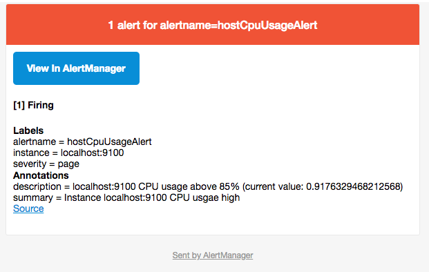

# 内置告警接收器Receiver

前上一小节已经讲过，在Alertmanager中路由负责对告警信息进行分组匹配，并将像告警接收器发送通知。告警接收器可以通过以下形式进行配置：

```
receivers:
  - <receiver> ...
```

每一个receiver具有一个全局唯一的名称，并且对应一个或者多个通知方式：

```
name: <string>
email_configs:
  [ - <email_config>, ... ]
hipchat_configs:
  [ - <hipchat_config>, ... ]
pagerduty_configs:
  [ - <pagerduty_config>, ... ]
pushover_configs:
  [ - <pushover_config>, ... ]
slack_configs:
  [ - <slack_config>, ... ]
opsgenie_configs:
  [ - <opsgenie_config>, ... ]
webhook_configs:
  [ - <webhook_config>, ... ]
victorops_configs:
  [ - <victorops_config>, ... ]
```

目前官方内置的第三方通知集成包括：邮件、 即时通讯软件（如Slack、Hipchat）、移动应用消息推送(如Pushover)和自动化运维工具（例如：Pagerduty、Opsgenie、Victorops）。Alertmanager的通知方式中还可以支持Webhook，通过这种方式开发者可以实现更多个性化的扩展支持。

## 与SMTP邮件集成

每一个receiver可以对应一组邮件通知配置email_configs，如下所示：

```
name: <string>
email_configs:
  [ - <email_config>, ... ]
```

email_config配置

```
# Whether or not to notify about resolved alerts.
[ send_resolved: <boolean> | default = false ]

# The email address to send notifications to.
to: <tmpl_string>

# The sender address.
[ from: <tmpl_string> | default = global.smtp_from ]

# The SMTP host through which emails are sent.
[ smarthost: <string> | default = global.smtp_smarthost ]

# SMTP authentication information.
[ auth_username: <string> | default = global.smtp_auth_username ]
[ auth_password: <secret> | default = global.smtp_auth_password ]
[ auth_secret: <secret> | default = global.smtp_auth_secret ]
[ auth_identity: <string> | default = global.smtp_auth_identity ]

# The SMTP TLS requirement.
[ require_tls: <bool> | default = global.smtp_require_tls ]

# The HTML body of the email notification.
[ html: <tmpl_string> | default = '{{ template "email.default.html" . }}' ]

# Further headers email header key/value pairs. Overrides any headers
# previously set by the notification implementation.
[ headers: { <string>: <tmpl_string>, ... } ]
```

如果所有的邮件配置使用了相同的SMTP配置，则可以直接定义全局的SMTP配置。

```
global:
  [ smtp_from: <tmpl_string> ]
  [ smtp_smarthost: <string> ]
  [ smtp_auth_username: <string> ]
  [ smtp_auth_password: <secret> ]
  [ smtp_auth_secret: <secret> ]
  [ smtp_auth_identity: <string> ]
  [ smtp_require_tls: <bool> | default = true ]
```

以Gmail邮箱为例:

```
global:
  smtp_smarthost: smtp.gmail.com:587
  smtp_from: <smtp mail from>
  smtp_auth_username: <usernae>
  smtp_auth_identity: <username>
  smtp_auth_password: <password>

receivers:
  - name: default-receiver
    email_configs:
      - to: <mail to address>
```

> 需要注意的是新的Google账号安全规则需要使用”应用专有密码“作为邮箱登录密码

这时如果手动拉高主机CPU使用率，使得监控样本数据满足告警触发条件。在SMTP配置正确的情况下，可以接收到如下的告警内容：



## 与Slack集成

> TODO

## 与微信集成

> 

## 自定义模板

默认情况下Alertmanager使用了系统自带的默认通知模板，模板源码可以从[https://github.com/prometheus/alertmanager/blob/master/template/default.tmpl](https://github.com/prometheus/alertmanager/blob/master/template/default.tmpl)获得。Alertmanager的通知模板基于[Go的模板系统](http://golang.org/pkg/text/template)。Alertmanager也支持用户定义和使用自己的模板，一般来说有两种方式可以选择。

第一种，基于模板字符串。用户可以直接在Alertmanager的配置文件中使用模板字符串，例如:

```
receivers:
- name: 'slack-notifications'
  slack_configs:
  - channel: '#alerts'
    text: 'https://internal.myorg.net/wiki/alerts/{{ .GroupLabels.app }}/{{ .GroupLabels.alertname }}'
```

第二种方式，自定义可复用的模板文件。例如，可以创建自定义模板文件custom-template.tmpl，如下所示：

```
{{ define "slack.myorg.text" }}https://internal.myorg.net/wiki/alerts/{{ .GroupLabels.app }}/{{ .GroupLabels.alertname }}{{ end}}
```

通过在Alertmanager的全局设置中定义templates配置来指定自定义模板的访问路径:

```
# Files from which custom notification template definitions are read.
# The last component may use a wildcard matcher, e.g. 'templates/*.tmpl'.
templates:
  [ - <filepath> ... ]
```

在设置了自定义模板的访问路径后，用户则可以直接在配置中使用该模板：

```
receivers:
- name: 'slack-notifications'
  slack_configs:
  - channel: '#alerts'
    text: '{{ template "slack.myorg.text" . }}'

templates:
- '/etc/alertmanager/templates/myorg.tmpl'
```