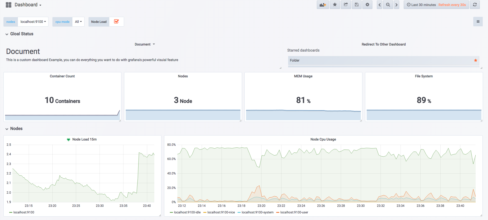
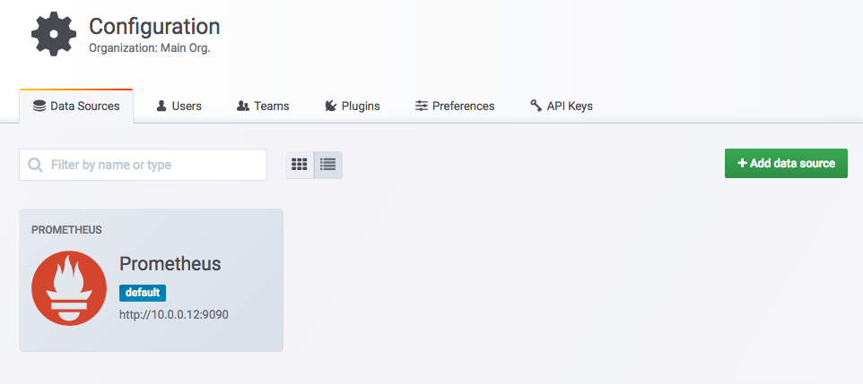

# Grafana简介

在第1章的“初识Prometheus”中我们已经尝试通过Grafana快速搭建过一个主机监控的Dashboard，在本章中将会带来读者进一步学习和使用Grafana这一可视化工具。

> TODO: 添加图例，显示Grafana的逻辑结构

## Grafana基本概念

* 数据源（Data Source）

Grafana支持对接多种数据源，官方提供了对Prometheus，Graphite，InfluxDB等数据源的支持。Grafana作为通用的可视化工具，支持将多个数据源的数据整合到单个可视化面板中。

用户可以在Grafana的设置（Configuration）页面，添加自定义的数据源：

* 面板（Panel）

Panel是Grafana中最基本的可视化单元。面板负责从不同的数据源中获取样本数据，并以可视化图表的形式对外展示。由于不同的数据源有自身特定的数据查询语言，因此,针对的不同的数据源panel提供特定的查询编辑器（Query Editor）用于帮助用户实现数据查询。

* 行(Row)

Row是可视化仪表盘中的一个逻辑分割符，用于管理一组相关的Panel。

* 仪表盘（Dashboard）

Dashboard负责将所有可视化相关的内容整合在一起，一个Dashboard中可以包含任意多的panel以及任意多的row。

通过Dashboard中的时间控制器（Time Picker）可以控制当前面板展示数据的时间范围。

通过Dashboard的模板参数（Templating variables）可以创建根据交互性的可视化仪表盘。通过Templateing variables可以动态的创建Row以及Panel，同时在Panel的Query Editor中也可以使用模板参数，从而通过用户交互动态的加载数据。

* 组织和权限管理

Grafana通过组织（Organization）提供了类似于多租户的模式。Organization中可以添加多个Datasource以及Dashboard。

在Organization中可以添加多个用户以及团队。Grafana基于角色和权限模式管理用户对Dashboard以及Dashboard的管理权限，其中内置了三个角色，分别是：View，Editor，Admin。 对于单个Dashboard而言Admin用户可以分配其它用户（User）或者团队（Team）的权限。

对于一组相关的Dashboard，在最新版本的Grafan中还提供目录（Folder）的形式统一管理其权限。