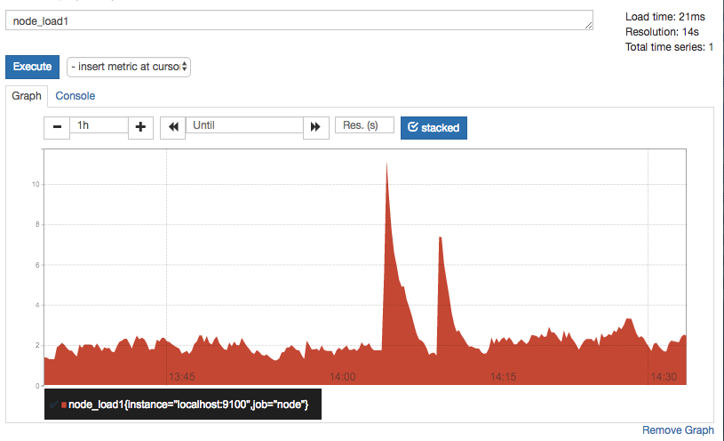

## 监控数据可视化

### 使用Prometheus UI

通过Prometheus UI用户可以利用PromQL实时查询监控数据，并且支持一些基本的数据可视化能力。进入到Prometheus UI,切换到Graph标签


通过PromQL则可以直接以可视化的形式显示查询到的数据。例如，查询主机负载变化情况，可以使用：

```
node_load1
```



查询主机CPU的使用率，由于node_cpu的数据类型是Counter，计算使用率需要使用rate()函数：

```
rate(node_cpu[2m])
```


这时如果要忽略是哪一个CPU的，只需要使用without表达式，将标签CPU去除后聚合数据即可：

```
avg without(cpu) (rate(node_cpu[2m]))
```


那如果需要计算系统CPU的总体使用率，通过排除系统闲置的CPU使用率即可获得:

```
1 - avg without(cpu) (rate(node_cpu{mode="idle"}[2m]))
```


从上面这些例子中可以看出，根据样本中的标签可以很方便地对数据进行查询，过滤以及聚合等操作。同时PromQL中还提供了大量的诸如rate()这样的函数可以实现对数据的更多个性化的处理。

## 使用Grafana创建可视化Dashboard

Prometheus UI提供了快速验证PromQL以及临时可视化支持的能力，而在大多数场景下引入监控系统通常还需要构建可以长期使用的监控数据可视化面板（Dashboard）。这时用户可以考虑使用第三方的可视化工具如Grafana，Grafana是一个开源的可视化平台，并且提供了对Prometheus的完整支持。

```
docker run -d -p 3000:3000 grafana/grafana
```

访问[http://localhost:3000](http://localhost:3000)就可以进入到Grafana的界面中，默认情况下使用账户admin/admin进行登录。在Grafana首页中显示默认的使用向导，包括：安装、添加数据源、创建Dashboard、邀请成员、以及安装应用和插件等主要流程:


这里将添加Prometheus作为默认的数据源，如下图所示，指定数据源类型为Prometheus并且设置Prometheus的访问地址即可，在配置正确的情况下点击“Add”按钮，会提示连接成功的信息：


在完成数据源的添加之后就可以在Grafana中创建我们可视化Dashboard了。Grafana提供了对PromQL的完整支持，如下所示，通过Grafana添加Dashboard并且为该Dashboard添加一个类型为“Graph”的面板。 并在该面板的“Metrics”选项下通过PromQL查询需要可视化的数据：


点击界面中的保存选项，就创建了我们的第一个可视化Dashboard了。 当然作为开源软件，Grafana社区鼓励用户分享Dashboard通过[https://grafana.com/dashboards](https://grafana.com/dashboards)网站，可以找到大量可直接使用的Dashboard：


Grafana中所有的Dashboard通过JSON进行共享，下载并且导入这些JSON文件，就可以直接使用这些已经定义好的Dashboard：

